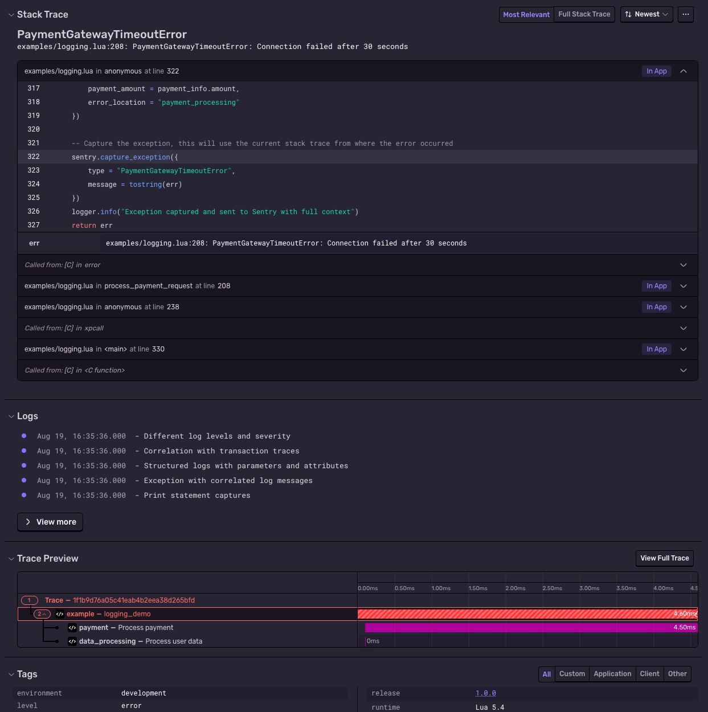
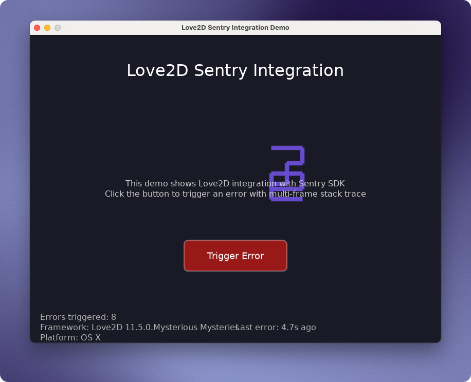

# Sentry SDK for Lua

> NOTE: This is a hackweek project and not officially supported by Sentry.
> Not all platforms are yet tested.
> 
> We accept PRs if you're willing to fix bugs and add features.
> If there's enough interest, we could invest more into this.

[](https://github.com/getsentry/sentry-lua/actions/workflows/test.yml)
[](https://codecov.io/gh/getsentry/sentry-lua)

A platform-agnostic Sentry SDK for Lua environments. Written in Teal Language for better type safety and developer experience.

The goal of this SDK is to be *portable* Lua code, so CI/tests run on Standard Lua, as well as LuaJIT, which can run on [Game Consoles](https://luajit.org/status.html#consoles),
one of [Sentry's latest platform investments](https://blog.sentry.io/playstation-xbox-switch-pc-or-mobile-wherever-youve-got-bugs-to-crush-sentry/).



## Features

- **Platform Agnostic**: Works across Redis, nginx, Roblox, game engines, and standard Lua
- **Type Safe**: Written in Teal Language with full type definitions
- **Comprehensive**: Error tracking, breadcrumbs, context management, and scoped operations
- **Performance Monitoring**: Object-oriented API for transactions and spans with distributed tracing
- **Distributed Tracing**: Automatic trace propagation across service boundaries via HTTP headers
- **Structured Logging**: Built-in logging with batching, print hooks, and trace correlation
- **Extensible**: Pluggable transport system for different environments

## Supported Platforms

- Standard Lua 5.1+ environments
- Roblox game platform
- LÖVE 2D game engine
- Solar2D/Corona SDK
- Defold game engine
- Redis (lua scripting)
- nginx/OpenResty

## Installation

### LuaRocks
```bash
luarocks install sentry/sentry
```

### Roblox
Import the module through the Roblox package system or use the pre-built releases.

### LÖVE 2D
The SDK automatically detects the Love2D environment and uses the lua-https module for reliable HTTPS transport. Simply copy the SDK files into your Love2D project:

```lua
-- main.lua
local sentry = require("sentry")
local logger = require("sentry.logger")

function love.load()
    sentry.init({
        dsn = "https://your-dsn@sentry.io/project-id",
        environment = "love2d",
        release = "game@1.0.0"
    })
    
    -- Optional: Enable logging integration
    logger.init({
        enable_logs = true,
        max_buffer_size = 10,
        flush_timeout = 5.0
    })
end

function love.update(dt)
    -- Flush transport periodically
    sentry.flush()
end

function love.quit()
    -- Clean shutdown
    sentry.close()
end
```

**HTTPS Support**: The Love2D example includes a pre-compiled `https.so` binary from [lua-https](https://github.com/love2d/lua-https) for reliable SSL/TLS support. This binary is committed to the repository for convenience. If you need to rebuild it for your platform:

```bash
cd examples/love2d/lua-https
cmake -Bbuild -S. -DCMAKE_BUILD_TYPE=Release -DCMAKE_INSTALL_PREFIX=$PWD/install
cmake --build build --target install
# Copy install/https.so to your Love2D project
```

See `examples/love2d/` for a complete interactive demo with error triggering and visual feedback.

## Quick Start

```lua
local sentry = require("sentry")

-- Initialize with your DSN
sentry.init({
   dsn = "https://your-dsn@sentry.io/project-id",
   environment = "production",
   release = "0.0.1"
})

-- Capture a message
sentry.capture_message("Hello Sentry!", "info")

-- Capture an exception
local success, err = pcall(function()
   error("Something went wrong!")
end)

if not success then
   sentry.capture_exception({
      type = "MyError",
      message = err
   })
end

-- Flush pending events immediately
sentry.flush()

-- Clean shutdown
sentry.close()
```

## API Reference

- `sentry.init(config)` - Initialize the Sentry client with configuration
- `sentry.capture_message(message, level)` - Capture a log message  
- `sentry.capture_exception(exception, level)` - Capture an exception
- `sentry.set_user(user)` - Set user context
- `sentry.set_tag(key, value)` - Add a tag for filtering
- `sentry.set_extra(key, value)` - Add extra debugging information
- `sentry.add_breadcrumb(breadcrumb)` - Add a breadcrumb for debugging context
- `sentry.flush()` - Force immediate sending of pending events
- `sentry.close()` - Clean shutdown of the Sentry client
- `sentry.with_scope(callback)` - Execute code with isolated scope
- `sentry.wrap(main_function, error_handler)` - Wrap function with error handling

## Distributed Tracing

The Sentry Lua SDK supports distributed tracing to improve debuggability across app and service boundaries.
Traces let you see how telemetry (errors/events, logs, etc) from different processes links together, making it easier to follow execution paths and uncover issues.
In addition, through spans, they highlight performance characteristics of your application, helping you detect and resolve bottlenecks.

### Requirements

For the distributed tracing examples, you'll need additional dependencies:

```bash
luarocks install pegasus    # HTTP server framework
luarocks install luasocket  # HTTP client library
```

### Basic Tracing

```lua
local sentry = require("sentry")
local performance = require("sentry.performance")

sentry.init({
   dsn = "https://your-dsn@sentry.io/project-id"
})

-- Start a transaction
local transaction = performance.start_transaction("user_checkout", "http.server")

-- Add spans for different operations
local validation_span = transaction:start_span("validation", "Validate cart")
-- ... validation logic ...
validation_span:finish("ok")

local payment_span = transaction:start_span("payment.charge", "Process payment")
-- ... payment logic ...
payment_span:finish("ok")

-- Finish the transaction
transaction:finish("ok")
```

### Advanced Tracing Features

#### Nested Spans and Context Management

```lua
local transaction = performance.start_transaction("api_request", "http.server")

-- Nested spans automatically maintain parent-child relationships
local db_span = transaction:start_span("db.query", "Get user data")
local user_id = get_user_from_db()
db_span:finish("ok")

-- Spans can be nested further
local processing_span = transaction:start_span("processing", "Process user data")

local validation_span = processing_span:start_span("validation", "Validate permissions")
validate_user_permissions(user_id)
validation_span:finish("ok")

local enrichment_span = processing_span:start_span("enrichment", "Enrich user data")
enrich_user_data(user_id)
enrichment_span:finish("ok")

processing_span:finish("ok")
transaction:finish("ok")
```

#### Adding Context and Tags

```lua
local transaction = performance.start_transaction("checkout", "business.process")

-- Add tags and data to transactions
transaction:add_tag("user_type", "premium")
transaction:add_tag("payment_method", "credit_card")
transaction:add_data("cart_items", 3)
transaction:add_data("total_amount", 99.99)

local span = transaction:start_span("payment.process", "Charge credit card")
-- Add context to individual spans
span:add_tag("processor", "stripe")
span:add_data("amount", 99.99)
span:add_data("currency", "USD")

-- Finish with status
span:finish("ok")  -- or "error", "cancelled", etc.
transaction:finish("ok")
```

### Distributed Tracing Examples

The SDK includes complete examples demonstrating distributed tracing:

- `examples/tracing/client.lua` - HTTP client that propagates trace context
- `examples/tracing/server.lua` - HTTP server with distributed tracing endpoints

To see distributed tracing in action:

1. Start the server: `lua examples/tracing/server.lua`
2. In another terminal, run the client: `lua examples/tracing/client.lua`
3. Check your Sentry dashboard to see connected traces across both processes

The examples demonstrate:
- Object-oriented API with method chaining on transactions and spans
- Automatic trace context propagation via HTTP headers (`sentry-trace`, `baggage`)
- Proper parent-child span relationships across service boundaries
- Error correlation within distributed traces
- Performance monitoring with detailed timing information

#### Manual Trace Propagation

For custom HTTP implementations or other transport mechanisms:

```lua
local tracing = require("sentry.tracing")

-- Get trace headers for outgoing requests
local headers = tracing.get_request_headers("https://api.example.com")
-- headers will contain sentry-trace and baggage headers

-- Continue trace from incoming headers on the receiving side
local incoming_headers = {
    ["sentry-trace"] = "abc123-def456-1",
    ["baggage"] = "user_id=12345,environment=prod"
}
tracing.continue_trace_from_request(incoming_headers)

-- Now start transaction with continued trace context
local transaction = performance.start_transaction("api_handler", "http.server")
-- This transaction will be part of the distributed trace
```

**Benefits of the new API:**
- **No global state**: Each transaction and span is explicitly managed
- **Better control**: Clear ownership of when operations start and finish  
- **Proper nesting**: Spans automatically inherit from their parent transaction/span
- **Type safety**: Full Teal type definitions for all methods
- **Easier debugging**: No hidden global state to track

## Structured Logging

The Sentry Lua SDK provides comprehensive logging capabilities with automatic batching, trace correlation, and print statement capture.

### Basic Logging

```lua
local sentry = require("sentry")
local logger = require("sentry.logger")

sentry.init({
   dsn = "https://your-dsn@sentry.io/project-id",
   _experiments = {
      enable_logs = true,
      hook_print = true  -- Automatically capture print() calls
   }
})

-- Initialize logger
logger.init({
   enable_logs = true,
   max_buffer_size = 100,
   flush_timeout = 5.0,
   hook_print = true
})

-- Log at different levels
logger.trace("Fine-grained debugging information")
logger.debug("Debugging information")
logger.info("General information")
logger.warn("Warning message")
logger.error("Error occurred")
logger.fatal("Critical failure")
```

### Structured Logging with Parameters

```lua
-- Parameterized messages for better searchability
local user_id = "user_123"
local order_id = "order_456"

logger.info("User %s placed order %s", {user_id, order_id})
logger.error("Payment failed for user %s with error %s", {user_id, "CARD_DECLINED"})

-- With additional attributes
logger.info("Order completed successfully", {user_id, order_id}, {
   order_total = 149.99,
   payment_method = "credit_card",
   shipping_type = "express",
   processing_time = 1.2
})
```

### Automatic Print Capture

```lua
-- These print statements are automatically captured as logs
print("Application started")  -- Becomes info-level log
print("Debug:", user_id, order_id)  -- Multiple arguments handled

-- No infinite loops - Sentry's own print statements are ignored
```

### Log Correlation with Traces

```lua
local transaction = performance.start_transaction("checkout", "business_process")

-- Logs within transactions are automatically correlated
logger.info("Starting checkout process")

local span = transaction:start_span("validation", "Validate cart")
logger.debug("Validating cart for user %s", {user_id})
span:finish("ok")

logger.warn("Payment processor slow: %sms", {2100})
transaction:finish("ok")

-- All logs will have trace_id linking them to the transaction
```

### Advanced Configuration

```lua
logger.init({
   enable_logs = true,
   max_buffer_size = 50,     -- Batch up to 50 logs
   flush_timeout = 10.0,     -- Flush every 10 seconds
   hook_print = true,        -- Capture print statements
   
   before_send_log = function(log_record)
      -- Filter sensitive information
      if log_record.body:find("password") then
         return nil  -- Don't send this log
      end
      
      -- Add custom attributes
      log_record.attributes["custom_field"] = {
         value = "custom_value",
         type = "string"
      }
      
      return log_record
   end
})
```

## Automatic Error Capture

For automatic capture of unhandled errors, use `sentry.wrap()` to wrap your main application function:

```lua
local sentry = require("sentry")

sentry.init({
   dsn = "https://your-dsn@sentry.io/project-id"
})

local function main()
   -- Your application logic here
   local config = nil
   local db_url = config.database_url  -- This error will be automatically captured
end

-- Simple automatic error capture
local success, result = sentry.wrap(main)

if not success then
   print("Error occurred but was sent to Sentry:", result)
end
```

You can also provide a custom error handler:

```lua
local function custom_error_handler(err)
   print("Custom handling:", err)
   -- Perform cleanup, logging, etc.
   return "Handled gracefully"
end

local success, result = sentry.wrap(main, custom_error_handler)
```

The `sentry.wrap()` approach automatically includes all your Sentry context (user data, tags, breadcrumbs) with captured errors, making it much simpler than manually wrapping every error-prone operation with `pcall`/`xpcall`.

See `examples/wrap_demo.lua` for a complete demonstration.

## Examples

There are several [examples in this repository](/examples/).

For example, the LÖVE framework example app:



## Development

### Prerequisites
- Teal Language compiler
- busted (for testing)
- Docker (for integration tests)

### Building
```bash
make install     # Install dependencies
make build       # Compile Teal to Lua
make test        # Run unit tests
make docs        # Generate documentation
make serve-docs  # Serve docs at http://localhost:8000
make lint-soft   # Lint with warnings (permissive)
```

**Windows:**
```cmd
build.bat serve-docs  # Serve docs locally
```

### Testing
```bash
# Unit tests
make test

# Docker integration tests
make docker-test-redis
make docker-test-nginx

# Full test suite
make test-all
```

## License

MIT License - see LICENSE file for details.
