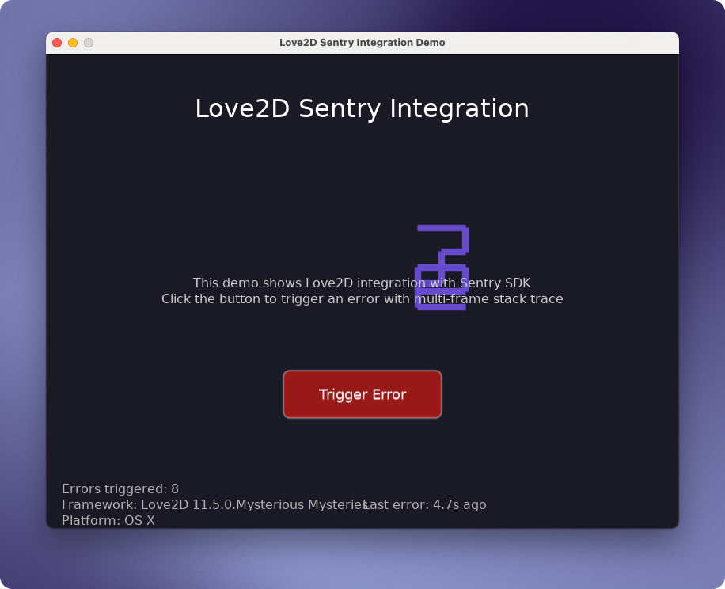

# Love2D Sentry Integration Demo

This example demonstrates how to integrate the Sentry Lua SDK with a Love2D game.




## Features

- **Love2D Transport**: Uses `love.thread` for asynchronous HTTP requests
- **Error Tracking**: Multi-frame stack traces with proper error context  
- **Logging Integration**: Structured logging with trace correlation
- **User Interaction**: Interactive button to trigger realistic errors
- **Platform Detection**: Automatic OS and runtime detection
- **Visual Demo**: Simple Sentry-themed UI with error statistics

## Running the Example

### Prerequisites

- Love2D 11.5 installed on your system
- Built Sentry Lua SDK (run `make build` from project root)

### Running Locally

1. From the project root, build the SDK:
   ```bash
   make build
   ```

2. Run the Love2D example (references built SDK via relative path):
   ```bash
   love examples/love2d
   ```

### Running as Package

You can also package the example as a `.love` file:

```bash
cd examples/love2d
zip -r sentry-love2d-demo.love . -x "*.DS_Store"
love sentry-love2d-demo.love
```

## How It Works

### Transport Implementation

The Love2D platform uses a custom transport (`src/sentry/platforms/love2d/transport.tl`) that:

1. Queues events and envelopes for async processing
2. Uses `love.thread` to send HTTP requests without blocking the game
3. Falls back to file logging if threads are unavailable
4. Integrates with Love2D's event loop for proper flushing

### Platform Detection

The SDK automatically detects:
- Operating system via `love.system.getOS()`
- Love2D version via `love.getVersion()`  
- Screen dimensions via `love.graphics.getDimensions()`

### Error Scenarios

The demo includes several error scenarios:

1. **Button Click Error**: Multi-level function calls ending in error
2. **Rendering Error**: Triggered via 'R' key  
3. **Generic Game Error**: Various error types with context

## Controls

- **Click Button**: Trigger a multi-frame error with full stack trace
- **Press 'R'**: Trigger a rendering error
- **Press 'Esc'**: Clean shutdown with Sentry flush

## Configuration

The demo sends data to the Sentry playground project. In production, you would:

1. Replace the DSN with your own project's DSN
2. Adjust the environment and release settings
3. Configure appropriate sampling rates
4. Set up proper user identification

## Integration Tips

When integrating Sentry into your Love2D game:

1. **Add SDK to Project**: Copy `src/sentry/` into your Love2D project
2. **Initialize Early**: Call `sentry.init()` in `love.load()` 
5. **Add Context**: Use breadcrumbs and tags for better debugging

### Clean API Usage
```lua
local sentry = require("sentry")  -- Auto-detects Love2D platform

function love.load()
    sentry.init({dsn = "your-dsn"})  -- Platform transport selected automatically
end
```

## Troubleshooting

If events aren't reaching Sentry:

1. Check console output for HTTP errors
2. Verify the DSN is correct
3. Ensure Love2D has network permissions
4. Check that `luasocket` is available
5. Enable debug mode for verbose logging

The transport will fall back to file logging (`sentry-events.log`) if HTTP requests fail.